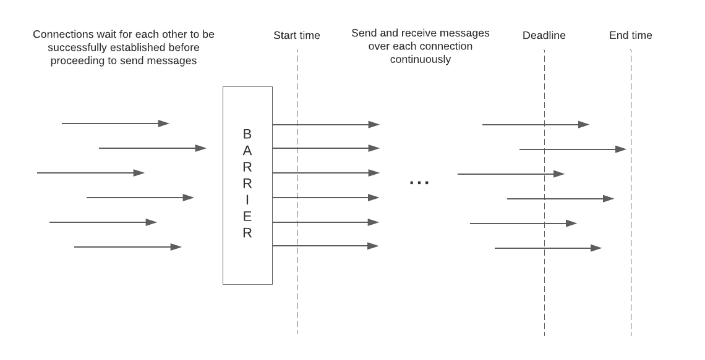
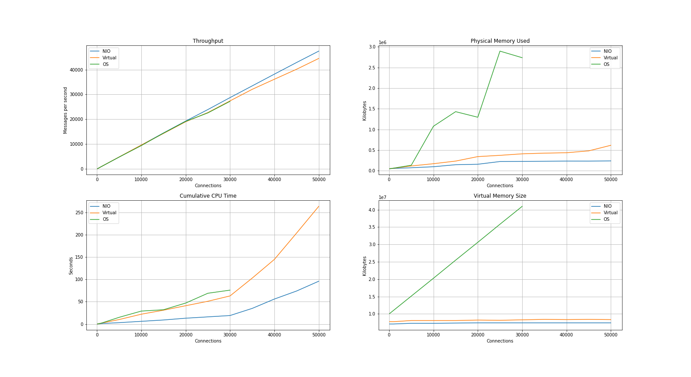

## Overview

[Project Loom](https://openjdk.java.net/projects/loom/) is the OpenJDK initiative to introduce user-mode threads in Java.

The purpose of this repository is to compare Project Loom [virtual threads](https://openjdk.java.net/jeps/8277131) to two 
existing alternatives in the context of network applications: classic OS threads and non-blocking NIO. 

## Methodology

Virtual threads are compared to the alternatives using an echo client-server protocol.

The server is tailored to maximize concurrent network connections and it supports 
a latency configuration for delaying echo responses by a precise amount. This introduced latency
is indistinguishable from network latency from the client perspective.

In the results described below, a latency of 1 second was used.

Three echo clients are compared: 

1. Client built atop non-blocking NIO framework
2. Client built atop classic OS threads
3. Client built atop Project Loom virtual threads

Clients are configured to run with a target concurrency level in terms of number of connections 
and configured to run for a fixed duration.

The various test clients behave the same way:

1. Establish persistent connections to echo server
2. Wait for all connections to be successfully established before proceeding with echo requests
3. Over each connection, send an echo request and receive an echo responses in a loop - when a response is received, immediately send subsequent request
4. When the target duration is reached, allow trailing echo transactions to complete
5. Measure throughput as the total number of echo transactions divided by the observed time elapsed



## Components

### NioEchoServer

The `NioEchoServer` class is a long-running echo server application. 
It supports the following command-line arguments:

1. Host - hostname used for passive server socket binding
2. Port - port number used for socket binding
3. Buffer size - the size in bytes of the buffer used for received and replaying echo messages
4. Latency - the delay to introduce between receiving an echo request and sending the response
5. Resolution - select polling timeout that determines the frequency with which delayed echo responses are examined
6. Accept queue length - queue length parameter set on passive socket bind

### NioEchoClient

The `NioEchoClient` class is a single-threaded, non-blocking, NIO-based test driver application that runs for a fixed duration 
at a target concurrent connection level. It supports the following command-line arguments:

1. Host - hostname of the destination echo server
2. Port - port number of the destination echo server
3. Number of connections - the number of concurrent connections to use
4. Content length - the size in bytes of each echo request message
5. Duration - the target test duration in milliseconds

### ThreadedEchoClient

The `ThreadedEchoClient` class is a multi-threaded test driver application that runs for a fixed duration
at a target concurrent connection level. It supports the following command-line arguments:

1. Host - hostname of the destination echo server
2. Port - port number of the destination echo server
3. Number of connections - the number of concurrent connections to use
4. Content length - the size in bytes of each echo request message
5. Duration - the target test duration in milliseconds
6. Loom - boolean flag denoting whether to use virtual threads

## Experiment

The following experiment was conducted with two EC2 instances in AWS, one running the server and another running the client.

* Region: `us-west-2`
* Instance type: `c5.2xlarge` compute optimized instance 8 vCPU and 16 GB of memory 
* OS: Amazon Linux 2 with Linux Kernel 5.10, AMI `ami-00f7e5c52c0f43726`

In order to facilitate the rapid creation of 50,000 connections, the following `sysctl` kernel parameter changes 
were committed on both hosts prior to the start of the experiment:

```
sysctl net.ipv4.ip_local_port_range="2000 64000"
sysctl net.ipv4.tcp_fin_timeout=30
sysctl net.core.somaxconn=8192
sysctl net.core.netdev_max_backlog=8000
sysctl net.ipv4.tcp_max_syn_backlog=8192
```

Java classes were compiled and executed with an OpenJDK 19 Loom early access build: `openjdk-19-loom+1-11_linux-x64`

https://download.java.net/java/early_access/loom/1/openjdk-19-loom+1-11_linux-x64_bin.tar.gz

The server instance used was started as follows:

```
jdk-19/bin/java loomtest.NioEchoServer <ip> 9000 32 1000 25 8192
```

The buffer size of 32 bytes was chosen to align with client configuration. The small magnitude was intended to minimize
overhead associated with packet processing and copying. The goal of the tests is to surface concurrency scaling, not 
packet processing.

Similarly, the 1,000 millisecond latency was chosen to minimize the processing cost of each connection and to leave
the focus on the costs associated with concurrency scaling.

Clients instances were started as follows:

```
jdk-19/bin/java --enable-preview loomtest.NioEchoClient <ip> 9000 <connections> 32 60000
```

```
jdk-19/bin/java --enable-preview loomtest.ThreadedEchoClient <ip> 9000 <connections> 32 60000 <loom>
```

The content size is set to a very low value of 32 bytes as noted above. Each test run had a target duration of 
60,000 milliseconds.

The following range of values was used for number of connections: 100, 1000, 5000, 10000, 15000, 20000, 25000, 30000, 35000, 40000, 45000, 50000

Command for running every echo client:

```
for i in $(echo "100 1000 5000 10000 15000 20000 25000 30000 35000 40000 45000 50000"); do
  jdk-19/bin/java --enable-preview loomtest.NioEchoClient 10.39.196.180 9000 $i 32 60000
  sleep 120
done
for i in $(echo "100 1000 5000 10000 15000 20000 25000 30000 35000 40000 45000 50000"); do
  jdk-19/bin/java --enable-preview loomtest.ThreadedEchoClient 10.39.196.180 9000 $i 32 60000 true
  sleep 120
done
for i in $(echo "100 1000 5000 10000 15000 20000 25000 30000 35000 40000 45000 50000"); do
  jdk-19/bin/java --enable-preview loomtest.ThreadedEchoClient 10.39.196.180 9000 $i 32 60000 false
  sleep 120
done
```

Metrics were gathered on the client host using the `ps` command:

```
while true; do ps -C java -o args:100,pcpu,c,cp,bsdtime,cputime,pid,pmem,rss,drs,trs,vsz; echo ""; sleep 1; done | tee ps.txt
```

## Results

The following diagram contains throughput data points reported by echo client executions and metrics reported by the ps command.



Throughput values are taken from the echo client standard output.

Cumulative CPU time values are taken from the `cputime` column of ps command output. 
The `cputime` in the last row associated with a process is used as the representative value.

Physical memory size values are taken from the `rss` column of ps command output.
The maximum value among all rows associated with a process is used as the representative value.

Virtual memory size values are taken from the `vsz` column of ps command output.
The maximum value among all rows associated with a process is used as the representative value.

Echo client tests using classic OS threads failed to complete successfully at 35,000 connections.
The failure was caused by the inability to create pthread 32309. This appears to be due to memory
resource constraints on the host and not due to any limits placed on the system user.
The `/proc/[pid]/limits` values do not suggest any problematic limits.

```
Args[host=10.39.196.180, port=9000, numConnections=35000, contentLength=32, duration=60000, loom=false]
[11.235s][warning][os,thread] Failed to start thread "Unknown thread" - pthread_create failed (EAGAIN) for attributes: stacksize: 1024k, guardsize: 0k, detached.
[11.235s][warning][os,thread] Failed to start the native thread for java.lang.Thread "pool-1-thread-32309"
Exception in thread "main" java.lang.OutOfMemoryError: unable to create native thread: possibly out of memory or process/resource limits reached
	at java.base/java.lang.Thread.start0(Native Method)
	at java.base/java.lang.Thread.start(Thread.java:1466)
	at java.base/java.lang.System$2.start(System.java:2510)
	at java.base/jdk.internal.vm.SharedThreadContainer.start(SharedThreadContainer.java:144)
	at java.base/java.util.concurrent.ThreadPoolExecutor.addWorker(ThreadPoolExecutor.java:952)
	at java.base/java.util.concurrent.ThreadPoolExecutor.execute(ThreadPoolExecutor.java:1363)
	at java.base/java.util.concurrent.AbstractExecutorService.submit(AbstractExecutorService.java:145)
	at loomtest.ThreadedEchoClient.lambda$main$1(ThreadedEchoClient.java:94)
	at java.base/java.util.stream.IntPipeline$1$1.accept(IntPipeline.java:180)
	at java.base/java.util.stream.Streams$RangeIntSpliterator.forEachRemaining(Streams.java:104)
	at java.base/java.util.Spliterator$OfInt.forEachRemaining(Spliterator.java:711)
	at java.base/java.util.stream.AbstractPipeline.copyInto(AbstractPipeline.java:509)
	at java.base/java.util.stream.AbstractPipeline.wrapAndCopyInto(AbstractPipeline.java:499)
	at java.base/java.util.stream.AbstractPipeline.evaluate(AbstractPipeline.java:575)
	at java.base/java.util.stream.AbstractPipeline.evaluateToArrayNode(AbstractPipeline.java:260)
	at java.base/java.util.stream.ReferencePipeline.toArray(ReferencePipeline.java:616)
	at java.base/java.util.stream.ReferencePipeline.toArray(ReferencePipeline.java:622)
	at java.base/java.util.stream.ReferencePipeline.toList(ReferencePipeline.java:627)
	at loomtest.ThreadedEchoClient.main(ThreadedEchoClient.java:95)
```

## Conclusions

* NIO, classic OS threads, and virtual threads are all very effective concurrency tools. 
Even classic OS threads scaled to a concurrency level of 30,000 without issue.
* The overhead of virtual threads is remarkably low. The resource utilization of virtual threads was 
not significantly more than with NIO. 
* The overhead of classic OS threads is indeed significant, particularly with respect to the process memory
footprint. The cumulative CPU time of echo clients using platform threads is only marginally higher than 
the other echo clients.
* The slogan "codes like sync, scaled like async" is accurate. Virtual threads are an excellent 
lternative to asynchronous programming with non-blocking NIO.